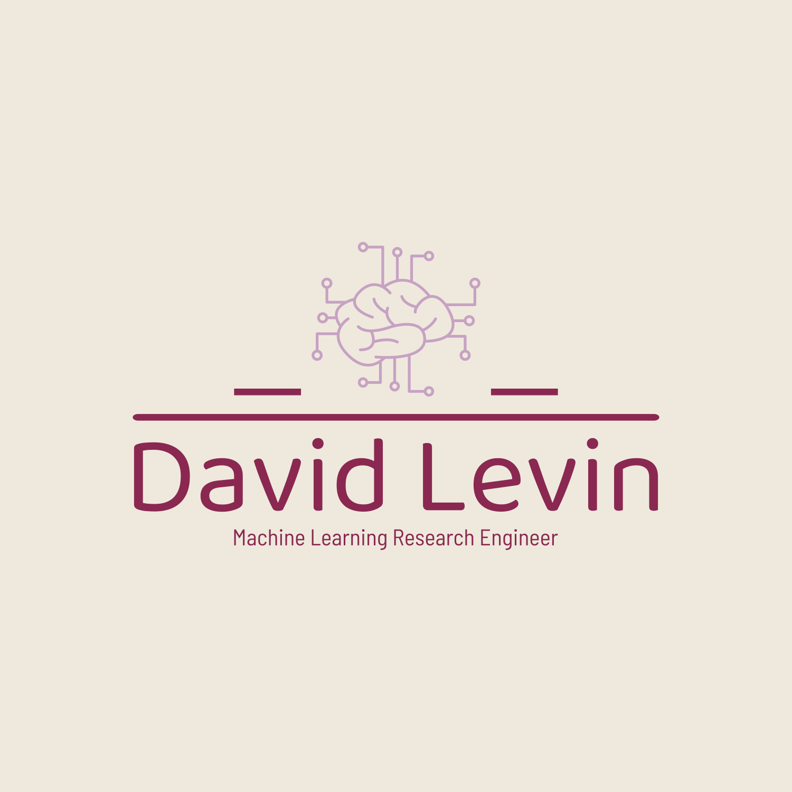

  

## 👨🏽‍💻 About me
* 🎓 MSc Electrical Engineering graduate from Bar-Ilan University.
* 📖 My Master's research focused on Graph-Based Feature Selection Models For Machine Learning Applications.
* ⚡️ Passionate about the world of Artificial Intelligence, particularly Deep Learning and its industrial applications.

## 🔭 Technologies and Tools

  <code></code> &nbsp;&nbsp;&nbsp;
  <code></code> &nbsp;&nbsp;&nbsp;
  <code></code> &nbsp;&nbsp;&nbsp;
  <code></code> &nbsp;&nbsp;&nbsp;
   
  <code></code> &nbsp;&nbsp;&nbsp;
  <code></code> &nbsp;&nbsp;&nbsp;
  <code></code> &nbsp;&nbsp;&nbsp;
  <code></code> &nbsp;&nbsp;&nbsp;
    
  <code></code> &nbsp;&nbsp;&nbsp;
  <code></code> &nbsp;&nbsp;&nbsp;
  <code></code> &nbsp;&nbsp;&nbsp;
  <code></code> &nbsp;&nbsp;&nbsp;
   
  <code></code> &nbsp;&nbsp;&nbsp;
  <code></code> &nbsp;&nbsp;&nbsp;
  <code></code> &nbsp;&nbsp;&nbsp;
  <code></code> &nbsp;&nbsp;&nbsp;

## 💻 Current project
[gbfs](https://github.com/davidlevinwork/gbfs): gbfs is a comprehensive repository dedicated to advancing Graph-Based Feature Selection methodologies in machine learning.  

The project houses two significant contributions to the field: GB-AFS and GB-BC-FS, each developed to address the intricate challenges of feature selection with graph-based solutions.

 
---

  
   &nbsp;&nbsp;&nbsp;&nbsp;
   &nbsp;&nbsp;&nbsp;&nbsp;
  

